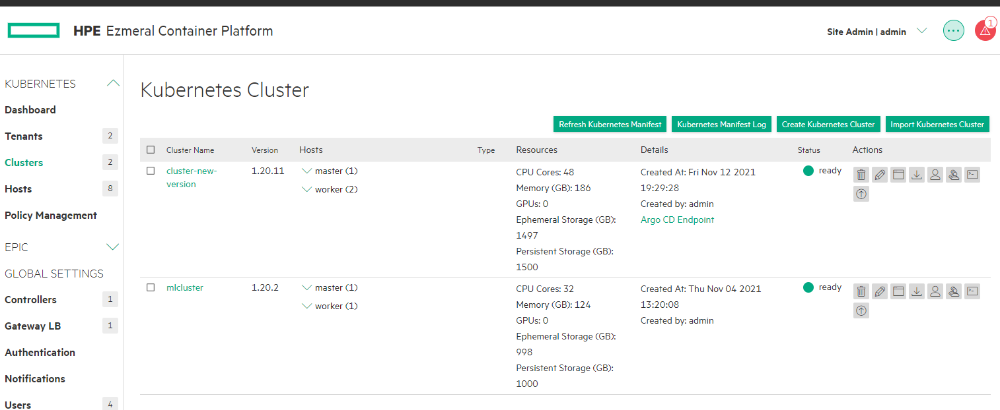
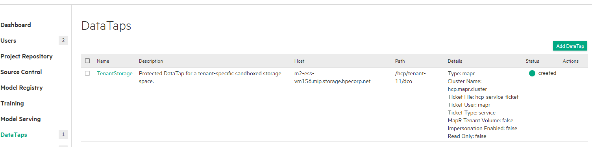
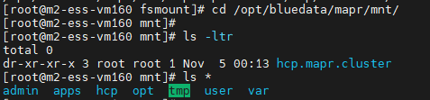
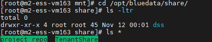
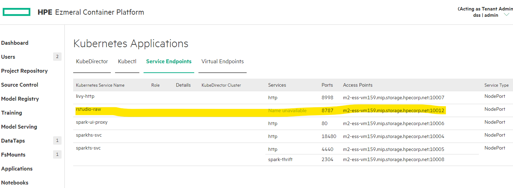
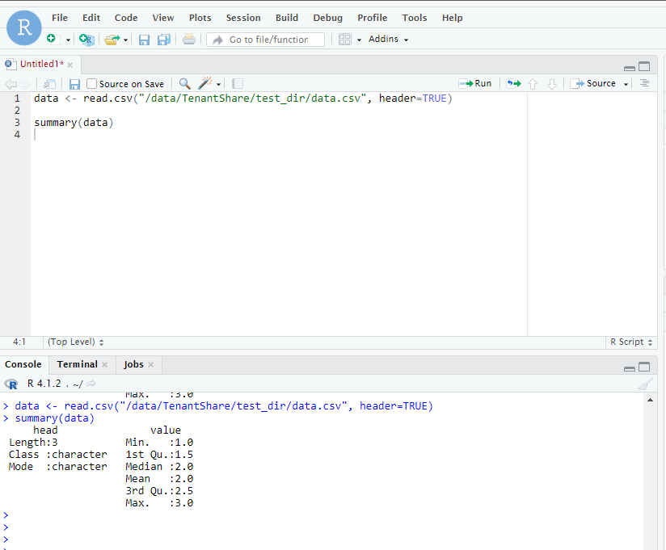

I finally completed to install an Ezmeral Container runtime (a.k.a. Ezmeral Container Platform). Please refer official document in https://docs.containerplatform.hpe.com/53/

I had suffered something. Firstly I have checked spark-operator and notebook. I didn't install EDF (Ezmeral Data Fabric, a.k.a MapR) but ECP embeded MapR Filesystem. 

With ECP, you can managed multi- kubenetes clusters in one view. 



I had created two clusters!!

BTW, I was interested in MLOps. ECP includes NMLFlow, TensorFlow, and spark-opeator, etc. But what about R user like me?

I decided to install Rstudio on kubenates. I found good link to follow Rstudio install - https://dharmeshkakadia.com/blog/rstudio-k8s/

But I hope to integrate this ECP MLOps process and share DTAP in ECP.


Basically, when ECP installs kubernete cluster, ECP includes `mapr-posix` file system in `/opt/bluedata/mapr/mnt` in `master node`.



and each work nodes mounted mapr file system. 



This volume is used to share data between MLOps.

For integrating this volume in Rstudio, we can add property, `hostPath` in k8s YAML.

rstudio-raw.yaml:
```
apiVersion: apps/v1
kind: Deployment
metadata:
  name: rstudio-raw
  labels:
    name: rstudio-raw
  namespace: dss
spec:
  replicas: 1
  selector:
    matchLabels:
      name: rstudio-raw
  template:
    metadata:
      labels:
        name: rstudio-raw
    spec:
      containers:
      - name : rstudio
        image: rocker/rstudio
        imagePullPolicy: "Always"
        ports:
        - containerPort: 8787
          protocol: TCP
        resources:
          limits:
            cpu: "2"
            memory: 4Gi
          requests:
            cpu: "2"
            memory: 4Gi
        command:
         - "/bin/bash"
         - "-c"
         - "--"
        args :
         - 'rstudio-server start ; sleep infinity'
        volumeMounts:
        - mountPath: /data
          mountPropagation: HostToContainer
          name: hpecp-fsmount
          readOnly: true
      volumes:
      - hostPath:
          path: /opt/bluedata/share/dss
          type: DirectoryOrCreate
        name: hpecp-fsmount
```

apply this - `kubectl create -f rstudio-raw.yaml`

```

# kubectl get deploy rstudio-raw -n dss
NAME          READY   UP-TO-DATE   AVAILABLE   AGE
rstudio-raw   1/1     1            1           46m

# kubectl get pod -n dss
NAME                                 READY   STATUS    RESTARTS   AGE
rstudio-raw-b9d44978f-vrxz7          1/1     Running   0          46m

```

And expose service
`kubectl expose deploy rstudio-raw --port=8787 --target-port=8787 --type=NodePort -n dss`

Now you can see the access point in ECP. 
go Applications > Service Endpoint



you can read data in ECP 

